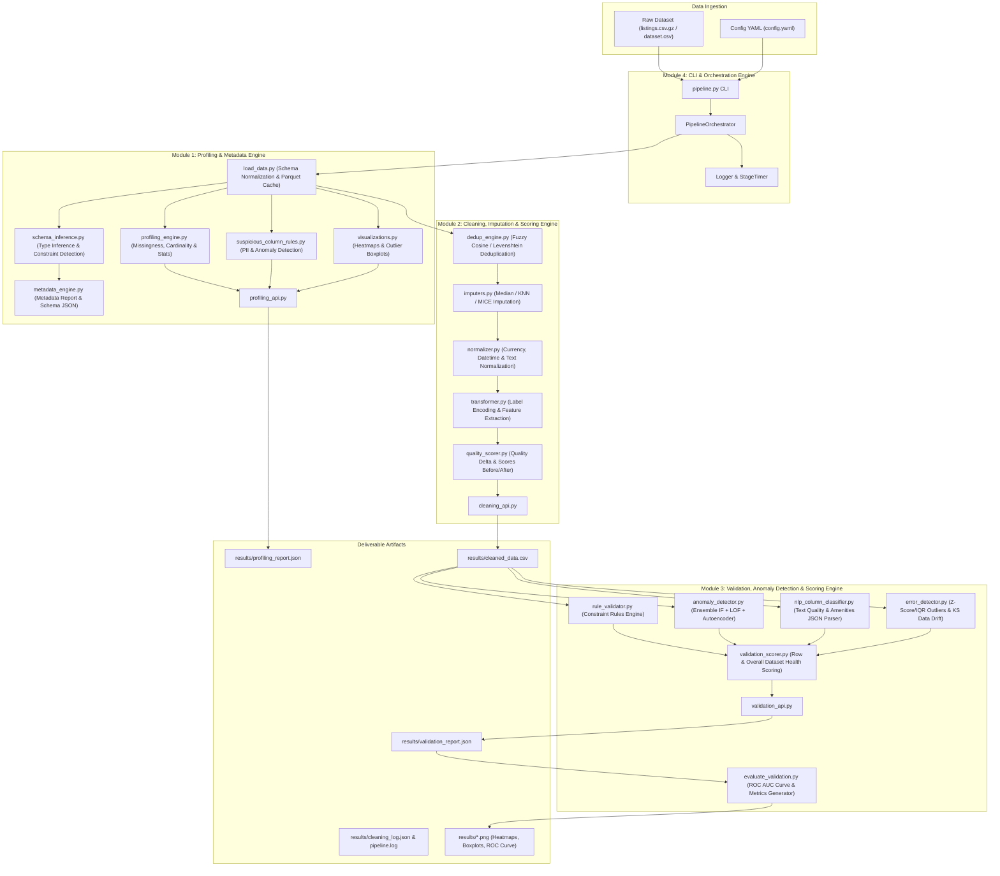

# Automated Data Cleaning & Validation System — Architecture Specification

## Executive Overview

The **Automated Data Cleaning & Validation System** is an enterprise-grade, end-to-end data engineering pipeline designed to profile, clean, impute, transform, validate, and score complex tabular datasets (such as Airbnb listings data). 

The system is structured as four decoupled modules orchestrated by a master CLI pipeline, featuring multi-model AI anomaly detection, NLP text analysis, automated schema inference, rule-based constraint validation, and comprehensive dataset health scoring.

---

## High-Level System Architecture Diagram

---

## Detailed Component Specifications

### 1. Module 1: Profiling & Metadata Engine
- **`load_data.py`**: Reads raw gzipped CSV datasets, standardizes column headers into strict `snake_case`, and caches standardized data into Parquet format for optimized I/O.
- **`schema_inference.py`**: Automatically infers statistical data types (`integer`, `float`, `boolean`, `datetime`, `string`, `categorical`), detects nullability, and extracts minimum/maximum value constraints.
- **`metadata_engine.py`**: Constructs `schema.json` and `metadata_report.json` detailing raw dataset metadata.
- **`profiling_engine.py`**: Computes missing value percentages, cardinality counts, numeric correlation matrices, and statistical distributions (mean, std, percentiles).
- **`suspicious_column_rules.py`**: Identifies sensitive PII columns (email, phone, SSN patterns), string formatting inconsistencies, and row-level suspicious patterns.
- **`visualizations.py`**: Generates publication-ready visual artifacts including missingness heatmaps (`heatmap_missing.png`), outlier boxplots (`outlier_min_nights.png`), and correlation heatmaps (`correlation_heatmap.png`).
- **`profiling_api.py`**: Consolidates all profiling outputs into the primary deliverable `profiling_report.json`.

### 2. Module 2: Cleaning, Imputation & Scoring Engine
- **`dedup_engine.py`**: Performs duplicate row detection using exact matching and fuzzy similarity algorithms (TF-IDF vectorization + cosine similarity / Levenshtein distance).
- **`imputers.py`**: Provides missing data imputation strategies including `median`, `mean`, `knn`, and iterative multivariate (`mice`).
- **`normalizer.py`**: Normalizes string representations of currency (`$1,200.00` -> `1200.0`), parses unstructured text (e.g. `"1.5 baths"` -> `1.5`), standardizes string casing, and parses ISO datetimes (`YYYY-MM-DD`).
- **`transformer.py`**: Executes categorical label encoding (`room_type_encoded`, `neighbourhood_group_cleansed_encoded`) and feature engineering (`price_per_bedroom`, `host_tenure_days`, `bathroom_type`).
- **`quality_scorer.py`**: Evaluates dataset quality across Completeness, Consistency, and Validity dimensions both before and after cleaning, outputting `quality_score_before.json`, `quality_score_after.json`, and `quality_delta.json`.
- **`cleaning_api.py`**: Orchestrates data cleaning and exports `cleaned_data.csv` and `cleaning_log.json`.

### 3. Module 3: Validation, Anomaly Detection & Scoring Engine
- **`rule_validator.py`**: Enforces domain constraint validation rules (non-negative price, valid host response rates, realistic minimum nights, geographical latitude/longitude boundaries).
- **`anomaly_detector.py`**: Employs a multi-model ensemble for multivariate anomaly detection combining:
  1. **Isolation Forest (IF)**: Tree-partitioning anomaly scoring.
  2. **Local Outlier Factor (LOF)**: Density-based local outlier detection.
  3. **Autoencoder Neural Network (MLPRegressor)**: Deep reconstruction error thresholding.
- **`nlp_column_classifier.py`**: Classifies text description quality (`GENUINE_LISTING_TEXT`, `NEAR_EMPTY_OR_SHORT`, `MISSING_OR_NULL`) and parses corrupted JSON/string arrays for amenities.
- **`error_detector.py`**: Performs statistical outlier detection (Z-Score and IQR methods) and measures distribution drift between baseline and cleaned datasets using Kolmogorov-Smirnov (KS) tests (`data_drift_report`).
- **`validation_scorer.py`**: Aggregates rule violations, model anomalies, NLP flaws, and statistical errors to compute row-level health scores and overall dataset health scores ($0-100$) and letter grades (`A`, `B`, `C`, `D`, `F`).
- **`evaluate_validation.py`**: Computes precision, recall, F1-score, accuracy, and generates ROC AUC curve visual artifacts (`roc_curve.png`).
- **`validation_api.py`**: Consolidates all validation diagnostics into `validation_report.json`.

### 4. Module 4: Orchestration, CLI, Versioning & Containerization
- **`pipeline_orchestrator.py`**: Orchestrates execution order across Stages 1-3 with structured timing logs.
- **`pipeline.py`**: Production CLI interface accepting `--input`, `--output`, and `--config` parameters.
- **`test_integration.py`**: Automated integration test suite running under `pytest`.
- **`.gitattributes` & `listings.csv.gz.dvc`**: Data artifact versioning via Git LFS and DVC.
- **`Dockerfile` & `.github/workflows/ci.yml`**: Docker containerization and automated GitHub Actions CI pipeline.

---

## Data Flow & File Artifact Schema

| Stage | Input Artifact | Processing Module | Primary Output Deliverable |
| :--- | :--- | :--- | :--- |
| **Stage 1** | `listings.csv.gz` | `profiling_api.py` | `profiling_report.json` |
| **Stage 2** | `raw_data_loaded.parquet` | `cleaning_api.py` | `cleaned_data.csv` |
| **Stage 3** | `cleaned_data.csv` | `validation_api.py` | `validation_report.json` |
| **Orchestration** | `config.yaml` | `pipeline.py` | Full directory (`results/`) |

---

## Non-Functional Requirements & Design Principles

1. **Idempotency & Reproducibility**: Running `pipeline.py` with identical inputs guarantees bitwise reproducible outputs and logs.
2. **Containerization**: The system is fully containerized via `Dockerfile`, ensuring zero-dependency execution across any cloud or local platform.
3. **Graceful Degraded Execution**: Fallbacks exist for missing parameters, malformed datetimes, and corrupted JSON strings without throwing unhandled exceptions.
4. **Data Version Control**: Raw dataset binaries are tracked using Git LFS and DVC pointer configurations to maintain clean Git commit histories.
