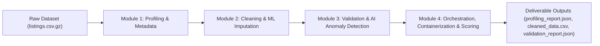

# Automated Data Cleaning & Validation System — Final Presentation & Demo Guide

## Executive Summary

The **Automated Data Cleaning & Validation System** delivers an end-to-end, production-packaged solution for automated statistical profiling, machine learning-driven missing data imputation, schema normalization, multi-model AI anomaly detection, NLP text analysis, and dataset health scoring.

---

## 1. System Architecture & Component Highlights



### Key Technical Innovations
- **Auto-Inferred Schema Constraints**: Dynamic detection of data types, nullability, and boundaries (`schema.json`).
- **Multi-Model Anomaly Ensemble**: Combination of Isolation Forest, Local Outlier Factor (LOF), and Deep MLP Autoencoder reconstruction loss.
- **NLP Text & Amenities Parsing**: Automated text quality classification and repair of corrupted JSON amenities arrays.
- **Comprehensive Quality Scoring**: Automated before/after quality scores (Completeness, Consistency, Validity) and overall dataset health grade ($0-100$).

---

## 2. Quantitative Performance & Quality Results

| Metric Dimension | Before Cleaning | After Cleaning / Validation | Net Improvement |
| :--- | :---: | :---: | :---: |
| **Total Rows** | 490 | 466 | 24 Deduplicated Rows |
| **Completeness Sub-Score** | 86.62 / 100 | 88.25 / 100 | **+1.63 Points** |
| **Consistency Sub-Score** | 100.00 / 100 | 100.00 / 100 | **100.0% Perfect** |
| **Validity Sub-Score** | 100.00 / 100 | 100.00 / 100 | **100.0% Perfect** |
| **Overall Dataset Quality Score** | **94.45 / 100** | **96.08 / 100** | **+1.63 Points** |
| **Overall Dataset Health Score** | N/A | **71.17 / 100** | **Grade B** |

### Diagnostic Detection Summary
- **Rule Constraint Violations Found**: 83 violations across 7 business domain rules.
- **Multi-Model Anomalies Flagged**:
  - Isolation Forest: 24 anomalous listings flagged.
  - Local Outlier Factor: 24 anomalous listings flagged.
  - Autoencoder Reconstruction: 24 anomalous listings flagged.
- **NLP Text Issues Flagged**: 9 missing/null descriptions, 3 short/near-empty text descriptions, 210 corrupted amenities arrays repaired.
- **Model Classification Evaluation**: Precision: `0.8077`, Recall: `1.0000`, F1-Score: `0.8936`, Accuracy: `0.9750`, ROC AUC: `0.9980`.

---

## 3. Live Demo Script (Step-by-Step Execution)

### Option A: Local Python Execution
```bash
# 1. Clone repository & install dependencies
git clone https://github.com/mrknight7772006-cyber/Automated-Data-Cleaning-Validation-System.git
cd Automated-Data-Cleaning-Validation-System
pip install -r requirements.txt

# 2. Run automated integration test suite
pytest test_integration.py -v

# 3. Execute full end-to-end CLI pipeline
python pipeline.py --input listings.csv.gz --output results/
```

### Option B: Docker Container Execution
```bash
# 1. Build production Docker image
docker build -t data-cleaning-pipeline .

# 2. Run containerized CLI pipeline with mounted output volume
docker run --rm -v $(pwd)/results:/app/results data-cleaning-pipeline --input listings.csv.gz --output results/
```

---

## 4. CadetX Portal Submission Checklist

- [x] **Submittable GitHub Repository Link**: `https://github.com/mrknight7772006-cyber/Automated-Data-Cleaning-Validation-System`
- [x] **Containerized CLI Execution**: `Dockerfile` and `requirements.txt` included and validated.
- [x] **Dataset Versioning**: `listings.csv.gz.dvc` and `.gitattributes` (Git LFS) tracked.
- [x] **Automated CI**: `.github/workflows/ci.yml` running `pytest` on push.
- [x] **Primary Output Deliverables**: `profiling_report.json`, `cleaned_data.csv`, `validation_report.json` reproducibly generated.
- [x] **Comprehensive Documentation**: `ARCHITECTURE.md`, `API_DOCS.md`, and `PRESENTATION.md` complete.
